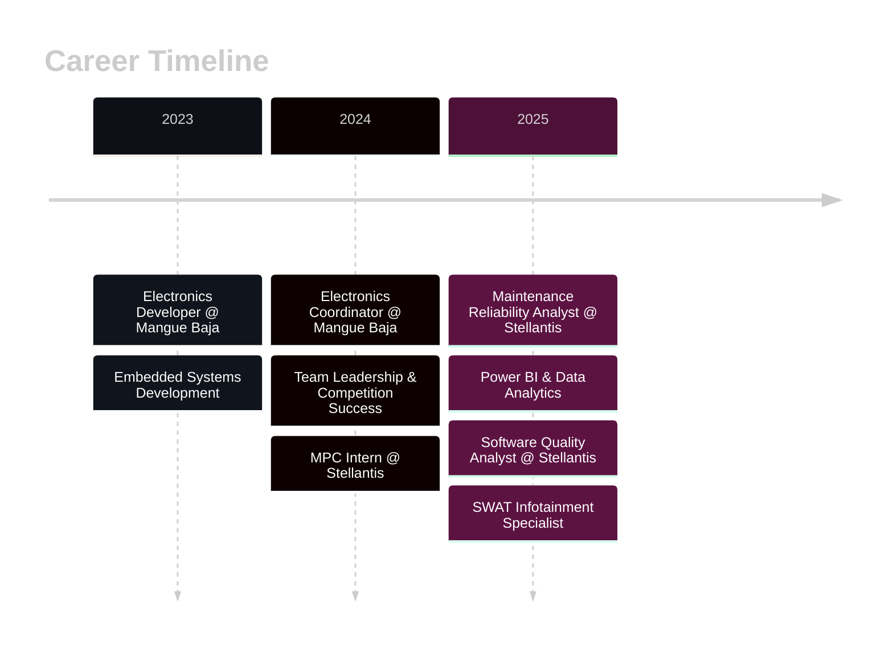

<div align="center">

<!-- Hero Header with Wave -->


<!-- Matrix Style Typing Effect -->
<a href="https://git.io/typing-svg">
  
</a>

<br><br>

<!-- Animated Social Badges with Icons -->
<p align="center">
  <a href="https://www.linkedin.com/in/daniloadryel/">
    
  </a>
  &nbsp;&nbsp;
  <a href="mailto:daniloa.adryel.r.x.s@gmail.com">
    
  </a>
  &nbsp;&nbsp;
  <a href="https://github.com/DARXS">
    
  </a>
  &nbsp;&nbsp;
  <a href="#">
    
  </a>
</p>

<!-- Animated Wave Separator -->


</div>

<br>

<!-- Profile Views Counter with Animation -->
<div align="center">
  
  
  
</div>

<br>

<!-- About Section with Neon Effect -->
<div align="center">


</div>

<br>

<table width="100%">
<tr>
<td width="50%" valign="top">


### **🎯 Engineering Identity**

```javascript
const danilo = {
  title: "Software Engineering Quality Analyst",
  company: "🏢 Stellantis",
  location: "📍 Betim, MG, Brazil",
  
  expertise: {
    diagnostics: "🔍 CAN/LIN Protocol Expert",
    embedded: "⚡ C/C++ Firmware Developer", 
    quality: "🎯 Root Cause Analysis Specialist",
    data: "📊 Power BI Analytics Engineer"
  },
  
  mission: "Building reliable automotive systems",
  motto: "Quality-driven | Data-informed | System-level"
};
```

<br>

**🚀 Current Role:** Leading SWAT diagnostics at Stellantis, specializing in post-production infotainment systems analysis and root cause investigation.

**🏆 Background:** Former Electronics Coordinator at **Mangue Baja SAE UFPE**, where I led competition-grade embedded systems development.

</td>
<td width="50%" valign="top">


### **⚡ Technical Arsenal**

<br>

**🔬 Diagnostics & Protocols**
```diff
+ CAN/LIN Bus Analysis & Troubleshooting
+ UDS (ISO 14229) Communication
+ Vector Tools: CANalyzer, CANcase, Diaglyser
+ FOTA/AOTA/MOTA Update Systems
```

**💻 Embedded Development**
```diff
+ C/C++ Firmware (STM32, ESP32)
+ FreeRTOS & Bare Metal Programming
+ PCB Design with KiCad
+ Hardware/Software Integration
```

**📊 Data Intelligence**
```diff
+ Power BI Dashboard Development
+ SAP PM System Integration
+ Python Analytics (Pandas, NumPy)
+ ETL Pipelines & KPI Optimization
```

</td>
</tr>
</table>

<br>

<!-- Animated Separator -->
<p align="center">
  
</p>

<br>

<!-- Professional Experience Section -->
<div align="center">


</div>

<br>

<div align="center">



</div>

<br>

<!-- Experience Cards -->
<details open>
<summary>


</summary>

<br>

<table>
<tr>
<td width="33%" align="center">

#### 🔍 **SWAT Analysis**


Advanced failure mode identification through comprehensive bench/vehicle testing

**Tools:**
- CANalyzer
- CANcase  
- Diaglyser
- CDA

</td>
<td width="33%" align="center">

#### 📡 **Technical Scope**


Infotainment & Connectivity Systems ownership

**Coverage:**
- IPC Clusters
- Radio/Display
- FOTA Updates
- Connected Services

</td>
<td width="33%" align="center">

#### 🎯 **Quality Impact**


End-to-end problem resolution

**Activities:**
- Warranty Analysis
- RCA & 8D Reports
- Customer Support
- Supplier Management

</td>
</tr>
</table>

</details>

<br>

<details>
<summary>


</summary>

<br>

<table>
<tr>
<td width="50%">

**🎯 Data Governance Excellence**
- Implemented real-time Visual Maintenance Management
- Standardized KPIs: MTTR, MTBF, Availability, Maintenance Cost
- Achieved 100% data integrity across SPW systems

**💻 Power BI Analytics Ecosystem**
- Built 15+ strategic dashboards integrating SAP PM
- Created ETL pipelines using Power Query & DAX
- Developed Emergency Work Order monitoring system

</td>
<td width="50%">

**🔧 Failure Analysis Mastery**
- Applied structured methodologies: 5 Whys, RCA, Ishikawa, FTA
- Identified critical failure patterns reducing downtime by 30%
- Supported data-driven maintenance optimization strategies

**📈 Business Impact**
- Reduced unplanned stops through predictive analytics
- Optimized resource allocation across production lines
- Generated executive reports for strategic decision-making

</td>
</tr>
</table>

</details>

<br>

<details>
<summary>


</summary>

<br>

<table>
<tr>
<td width="60%">

**👥 Leadership & Development**
- Managed complete E/E architecture lifecycle (requirements → validation)
- Implemented V-Model methodology for automotive product development
- Adapted SCRUM Agile framework for engineering milestones
- Designed automotive-grade PCBs using KiCad
- Programmed firmware in C/C++ for ESP32/STM32
- Integrated CAN, UART, I2C, SPI communication protocols

**🛠️ Technical Innovations**
- Developed telemetry analysis tool → **+13% performance**
- Created LoRa GPS tracking system → **1.5km range**
- Built wireless acceleration timer → **-45% test time**
- Designed modular wiring harness → **-60% MTTR**

</td>
<td width="40%" align="center">

#### 🏆 **Competition Success**


<br><br>

**2024 National**
- 🥉 3rd Electronics
- 🏅 5th Overall

**2024 Regional**
- 🥇 1st Overall
- 🥇 1st Presentation

**2023 Regional**
- 🥇 1st Presentation

</td>
</tr>
</table>

</details>

<br>

<!-- Animated Separator -->
<p align="center">
  
</p>

<br>

<!-- Tech Stack Section -->
<div align="center">


</div>

<br>

<!-- Animated Tech Icons -->
<p align="center">
  
  
  
  
</p>

<br>

### **🚗 Automotive & Diagnostics**

<p align="center">
  
  
  
  
  
  
</p>

### **💻 Embedded Systems & Firmware**

<p align="center">
  
  
  
  
  
  
  
  
</p>

### **📊 Data Analytics & Business Intelligence**

<p align="center">
  
  
  
  
  
  
  
  
</p>

### **⚙️ Methodologies, Tools & Quality**

<p align="center">
  
  
  
  
  
  
  
  
</p>

<br>

### **📊 Skill Proficiency Matrix**

<div align="center">

| Domain | Proficiency | Technologies |
|:------:|:-----------:|:-------------|
| **🚗 Automotive Diagnostics** |  | CAN/LIN, Vector Tools, UDS, FOTA |
| **⚡ Embedded C/C++** |  | STM32, ESP32, FreeRTOS, Bare Metal |
| **🎯 Quality Engineering** |  | FMEA, RCA, 8D, V-Model, Ishikawa |
| **📊 Power BI & Analytics** |  | DAX, ETL, SAP PM Integration |
| **🐍 Python Development** |  | Pandas, NumPy, Matplotlib, Automation |
| **🔌 PCB Design** |  | KiCad, Signal Integrity, EMC |

</div>

<br>

<!-- Animated Separator -->
<p align="center">
  
</p>

<br>

<!-- Featured Projects Section -->
<div align="center">


</div>

<br>

<!-- Project Cards -->
<table width="100%">
<tr>
<td width="50%" valign="top">

<div align="center">

### **📊 Telemetry Analysis Suite**


</div>

<br>

<p align="center">
  
  
  
  
</p>

Desktop application designed for processing raw vehicle telemetry data from CSV files. Features advanced digital filtering algorithms, real-time KPI extraction, and interactive visualization dashboards.

**📈 Impact:** Vehicle performance improved by **+13%**

**🔧 Key Features:**
- Advanced signal processing (FFT, Butterworth filters)
- Real-time data visualization with Matplotlib
- Automated KPI extraction and reporting
- Export to PDF and Excel formats

<p align="center">
  <a href="https://github.com/DARXS">
    
  </a>
</p>

</td>
<td width="50%" valign="top">

<div align="center">

### **📡 LoRa GPS Tracking System**


</div>

<br>

<p align="center">
  
  
  
  
</p>

Real-time GPS tracking unit with SD card logging and LoRa wireless transmission. Purpose-built for off-road competition environments with long-range communication capabilities.

**🛰️ Impact:** Real-time tracking with **1.5km range**

**🔧 Key Features:**
- Multi-task architecture with FreeRTOS
- LoRa SX1278 transceiver integration
- GPS NEO-6M with NMEA parsing
- SD card data logging for offline analysis
- Low-power battery operation

<p align="center">
  <a href="https://github.com/DARXS">
    
  </a>
</p>

</td>
</tr>

<tr>
<td width="50%" valign="top">

<div align="center">

### **⏱️ Wireless Acceleration Timer**


</div>

<br>

<p align="center">
  
  
  
</p>

Automated timing system using ESP-NOW protocol for 0-100m acceleration tests with millisecond precision. Designed to replace manual stopwatch methods with wireless gate synchronization.

**⚡ Impact:** Reduced setup/test time by **-45%**

**🔧 Key Features:**
- Wireless synchronization between start/finish gates
- Finite state machine-based control logic
- Battery-powered autonomous operation
- LCD display for real-time race results
- Event logging with timestamps

<p align="center">
  <a href="https://github.com/DARXS">
    
  </a>
</p>

</td>
<td width="50%" valign="top">

<div align="center">

### **🔌 Modular Wiring Harness**


</div>

<br>

<p align="center">
  
  
  
</p>

Automotive-grade electrical architecture designed for extreme off-road conditions. Features intelligent fault segmentation system for rapid diagnosis and repair in competition environments.

**🔧 Impact:** Reduced MTTR by **-60%**

**🛠️ Design Highlights:**
- Modular quick-disconnect connector system
- Functional zone color coding and labeling
- Weather-sealed IP67 protection
- Optimized weight distribution
- Strain relief and vibration protection
- Complete electrical documentation

<p align="center">
  <a href="https://github.com/DARXS">
    
  </a>
</p>

</td>
</tr>
</table>

<br>

<!-- Animated Separator -->
<p align="center">
  
</p>

<br>

<!-- Awards Section -->
<div align="center">


</div>

<br>

<table width="100%">
<tr>
<td width="50%" valign="top">

<div align="center">

### **🏆 Competition Awards**


</div>

<br>

#### **🏁 Baja SAE Brasil 2024** *(National Championship)*

<p align="center">
  
</p>
<p align="center">
  
</p>

<br>

#### **🏁 Baja SAE Nordeste 2024** *(Regional Championship)*

<p align="center">
  
</p>
<p align="center">
  
</p>

<br>

#### **🏁 Baja SAE Nordeste 2023**

<p align="center">
  
</p>

<br>

<p align="center">
  <b>Team:</b> Mangue Baja UFPE<br>
  <b>Role:</b> Electronics Coordinator & Developer
</p>

</td>
